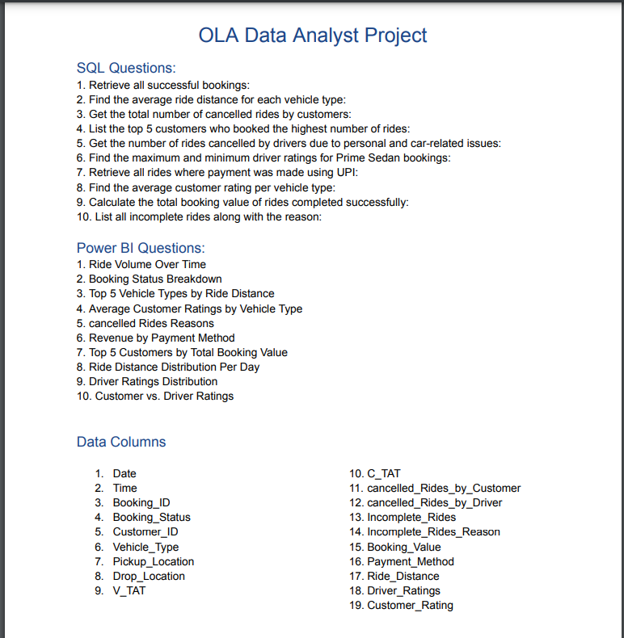
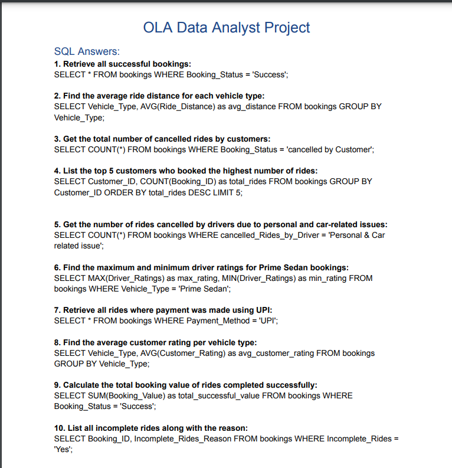

# Ola-data-analysis

## 📊 End-to-End Data Analysis of Ola Rides using SQL, Power BI, and Excel

### 🚀 This project provides data-driven insights into ride trends, cancellations, revenue, and customer ratings using:  
✅ SQL Queries – Data extraction & transformation   
✅ Power BI Dashboard – Interactive visualizations  
✅ Excel Processing – Data cleaning & structuring  

---

## 📌 Project Overview
---
This project analyzes Ola ride data to uncover business insights. Key aspects covered:
✔ Ride trends & booking status breakdown
✔ Cancellations by customers & drivers
✔ Revenue distribution by payment method
✔ Top customers & vehicle types by ride distance
✔ Customer vs. Driver Ratings

📌 Project Workflow:

---

## 🛠️ Tools Used
---
🔹 SQL – For data extraction & querying  
🔹 Power BI – For dashboard creation & visualization  
🔹 Excel – For data pre-processing   

🔍 Data Insights & Analysis
---
### 📌 SQL Analysis  

✔ Retrieve total successful bookings  
✔ Find the average ride distance per vehicle type   
✔ Identify the top 5 customers based on rides & booking value   
✔ Analyze cancellation reasons from customers & drivers  
✔ Compute customer & driver ratings distribution   

📌 Check the SQL Query Results:

### 📊 Power BI Dashboard

Created an interactive dashboard to visualize ride data trends:
📈 Ride Volume Over Time
📊 Booking Status Breakdown
🚗 Top 5 Vehicle Types by Ride Distance
💳 Revenue by Payment Method
⭐ Customer vs. Driver Ratings

📌 Check the Power BI Dashboard Output:

[POWER BI DASHBOARD ANSWERS](OLA_POWER_BI-ANSWERS)

### 🚀 How to Use This Project?

1️⃣ Download the dataset:
[OLA Dataset](OLA_DATASET.csv)

2️⃣ SQL Query Results:
[SQL Answers](OLA_SQL-ANSWERS.png)

3️⃣ Power BI Dashboard:
[Power BI Dashboard](OLA_POWER_BI-ANSWERS.png)

